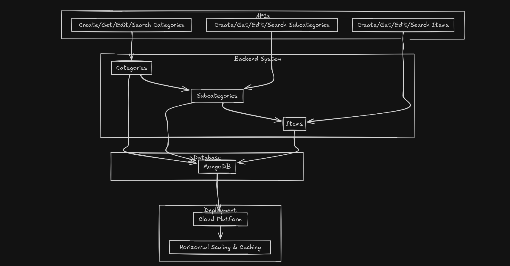

 # Guestara Internship Assignment: Node.js Backend for Menu Management

This project is a Node.js backend server designed for menu management. The menu is divided into three hierarchical parts: Category, Sub-Category, and Items. The API provides CRUD (Create, Read, Update, Delete) operations for each part and allows searching for items by name.

## Assignment Objectives

- Project Setup
- Create, Retrieve, and Edit (Update) operations for Category, Sub-Category, and Items
- Search functionality for items by name
- Comprehensive documentation

## Table of Contents

- [Project Setup](#project-setup)
- [API Endpoints](#api-endpoints)
  - [Category Endpoints](#category-endpoints)
  - [Sub-Category Endpoints](#sub-category-endpoints)
  - [Item Endpoints](#item-endpoints)
  - [Search Endpoint](#search-endpoint)
- [Running the Project Locally](#running-the-project-locally)
- [Deployment](#deployment)
- [Short Answer Questions](#short-answer-questions)

## Project Setup

The project is set up using Node.js and Express.js. It uses MongoDB as the database due to its flexibility in handling hierarchical data structures, which is essential for managing categories, sub-categories, and items.

## API Endpoints

### Category Endpoints

- **Create Category**
  - **POST** `/api/categories/create`
  - **Attributes**:
    - `name`: String
    - `image`: URL
    - `description`: String
    - `taxApplicability`: Boolean
    - `tax`: Number (if applicable)
    - `taxType`: String

- **Get All Categories**
  - **GET** `/api/categories/getAllCategories`

- **Get Category by ID or Name**
  - **GET** `/api/categories/getCategory/:idOrName`

- **Edit Category**
  - **PUT** `/api/categories/edit/:id`

### Sub-Category Endpoints

- **Create Sub-Category**
  - **POST** `/api/subcategories/create/:categoryId`
  - **Attributes**:
    - `name`: String
    - `image`: URL
    - `description`: String
    - `taxApplicability`: Boolean (default: Category tax applicability)
    - `tax`: Number (default: Category tax number)

- **Get All Sub-Categories**
  - **GET** `/api/subcategories/getAllSubCategories`

- **Get All Sub-Categories under a Category**
  - **GET** `/api/subcategories/getByCategory/:categoryId`

- **Get Sub-Category by ID or Name**
  - **GET** `/api/subcategories/:idOrName`

- **Edit Sub-Category**
  - **PUT** `/api/subcategories/edit/:subCategoryId`

### Item Endpoints

- **Create Item**
  - **POST** `/api/items/create`
  - **Attributes**:
    - `name`: String
    - `image`: URL
    - `description`: String
    - `taxApplicability`: Boolean
    - `tax`: Number (if applicable)
    - `baseAmount`: Number
    - `discount`: Number
    - `totalAmount`: Number (Base Amount - Discount)

- **Get All Items**
  - **GET** `/api/items/get`

- **Get All Items under a Category**
  - **GET** `/api/items/get/category/:categoryId`

- **Get All Items under a Sub-Category**
  - **GET** `/api/items/get/sub-category/:subCategoryId`

- **Get Item by ID**
  - **GET** `/api/items/get/:itemId`

- **Search Item by Name**
  - **GET** `/api/items/get/search?name=ItemName`

- **Edit Item**
  - **PUT** `/api/items/edit/:itemId`

 

## Usage

1. **Create a New Item**
   - Send a `POST` request to `/api/items/create` with the required item attributes.

2. **Get All Items**
   - Send a `GET` request to `/api/items/get` to retrieve all items.

3. **Get Items under a Specific Category**
   - Send a `GET` request to `/api/items/get/category/:categoryId` to retrieve items under a specific category.

4. **Get Items under a Specific Sub-Category**
   - Send a `GET` request to `/api/items/get/sub-category/:subCategoryId` to retrieve items under a specific sub-category.

5. **Get Item by ID**
   - Send a `GET` request to `/api/items/get/:itemId` to retrieve a specific item by its ID.

6. **Search Items by Name**
   - Send a `GET` request to `/api/items/get/search?name=ItemName` to search for items by name.

7. **Edit an Item**
   - Send a `PUT` request to `/api/items/edit/:itemId` with the updated attributes to modify an existing item.

 

## Running the Project Locally

1. **Clone the repository:**
    ```bash
    git clone https://github.com/Atharva-Kanherkar/Guestara_Assignment.git
    ```

2. **Navigate to the project directory:**
    ```bash
    cd Guestara_Assignment
    ```

3. **Install the dependencies:**
    ```bash
    npm install
    ```

4. **Create a `.env` file in the root directory and add your MongoDB connection string:**
    ```plaintext
    MONGO_URI=your_mongodb_connection_string
    PORT=5000
    ```

5. **Start the development server:**
    ```bash
    npm run dev
    ```

6. **Test the API using Postman or any other API testing tool.**
    - There is a sample data JSON file for testing. Please use that, and use the live link or post man for making GET/PUT/POST requests. 

## Deployment

The project has been deployed and can be accessed at:  
[Guestara Assignment on Render](https://guestara-assignment-s1ka.onrender.com)

## Short Answer Questions

1. **Which database have you chosen and why?**  
   I chose MongoDB because its flexible schema design is ideal for managing hierarchical data like categories and items. It simplifies data organization and scaling, making it a better fit for this API. While PostgreSQL is powerful, it's more rigid and might be overkill for a small-scale project like this. MongoDB's adaptability and ease of use made it the clear choice.

2. **3 things that you learned from this assignment?**  
   - Efficient structuring of RESTful APIs.
   - Time management: I learned how to handle pressure, balancing college exams and this assignment simultaneously.
   - Importance of well-documented and readable code, making it easier for collaboration.
   - This one's an extra, but deploying to production was my first time doing it!

3. **What was the most difficult part of the assignment?**  
   - The most challenging aspect was creating a database schema that accurately reflects the relationships between categories, sub-categories, and items, while maintaining efficient CRUD operations.
   - Designing a whole architecture from scratch proved to be a difficult task.

4. **What would you have done differently given more time?**  
   - Implement advanced features like pagination for listing endpoints, better error handling with custom middleware, and integrating authentication for secure access.
   - Experimented with other databases for scalability.
   - Written the entire codebase in TypeScript for enhanced security and production readiness.
   - Added more in-depth documentation and comments.


**System Design of the same**
